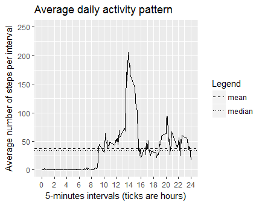
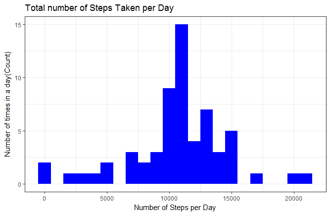
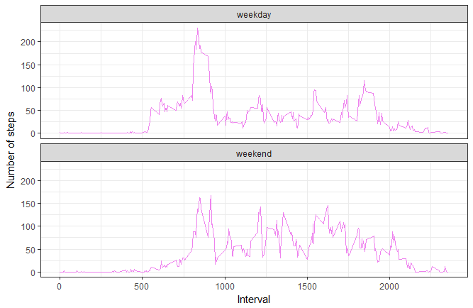

```r
library(ggplot2)
library(scales)
library(Hmisc)
library(lubridate)
library(dplyr)
library(ggthemes)

loadData <- function(dataURL="", destF="default.csv", method = NULL){
  if(!file.exists(destF)){
    temp <- tempfile()
    download.file(dataURL, temp, method = method)
    unzip(temp, destF)
    unlink(temp)
  }else{
    message("Data already downloaded.")
  }
}

dataURL <-"https://d396qusza40orc.cloudfront.net/repdata%2Fdata%2Factivity.zip"


loadData(dataURL, "activity.csv")
```

```
## Data already downloaded.
```

```r
active <- read.csv("activity.csv")

active$date <- as.Date(active$date, format = "%Y-%m-%d")
active$interval <- as.factor(active$interval)
str(active)
```

```
## 'data.frame':	17568 obs. of  3 variables:
##  $ steps   : int  NA NA NA NA NA NA NA NA NA NA ...
##  $ date    : Date, format: "2012-10-01" "2012-10-01" ...
##  $ interval: Factor w/ 288 levels "0","5","10","15",..: 1 2 3 4 5 6 7 8 9 10 ...
```

```r
#What is mean total number of steps taken per day?

steps_per_day <- aggregate(steps ~ date, active, sum)
colnames(steps_per_day) <- c("date","steps")
head(steps_per_day)
```

```
##         date steps
## 1 2012-10-02   126
## 2 2012-10-03 11352
## 3 2012-10-04 12116
## 4 2012-10-05 13294
## 5 2012-10-06 15420
## 6 2012-10-07 11015
```

```r
period_mean  = mean(steps_per_day$steps, na.rm=TRUE)
period_median = median(steps_per_day$steps, na.rm=TRUE)
print(paste("Average steps a day over the two months period is", as.character(round(period_mean)), "and the median is", as.character(round(period_median))))
```

```
## [1] "Average steps a day over the two months period is 10766 and the median is 10765"
```

```r
qplot(x= steps_per_day$steps, main= "Mean total number of steps taken per day", geom="blank") + 
  geom_histogram(breaks= seq(0, 24000, 500), color="black", fill="white") +
  scale_x_continuous(name = "Total Number of steps taken per day", breaks = seq(0, 25000, 5000), limits=c(0, 25000)) +
  scale_y_continuous(name="Number of days", breaks=seq(0, 12, 2), limits=c(0,12)) +
  geom_vline(mapping=aes(xintercept=c(period_mean, period_median), linetype=factor(c("mean", "median"))), show.legend=TRUE) +
  scale_linetype_manual(values=c(2,3)) +
  labs(linetype="Legend") 
```


```r
#What is the average daily activity pattern?

steps_per_interval <- aggregate(active$steps, 
                                by = list(interval = active$interval),
                                FUN=mean, na.rm=TRUE)
#convert to integers
##this helps in plotting
steps_per_interval$interval <- 
  as.integer(levels(steps_per_interval$interval)[steps_per_interval$interval])
colnames(steps_per_interval) <- c("interval", "steps")

activity_mean <- summarize(group_by(steps_per_interval, interval), steps= mean(steps, na.rm= TRUE))

day_mean <- mean(activity_mean$steps)
day_median <- median(activity_mean$steps)

qplot(x=activity_mean$interval/60, y=activity_mean$steps, geom="line", main = "Average daily activity pattern") +
  scale_x_continuous(name="5-minutes intervals (ticks are hours)", breaks=seq(0,24,2), limits=c(0,24)) +
  scale_y_continuous(name= "Average number of steps per interval", breaks = seq(0,250,50), limits=c(0,250)) +
  geom_hline(mapping=aes(yintercept=c(day_mean, day_median), linetype=factor(c("mean", "median"))), show.legend=TRUE) +
  scale_linetype_manual(values=c(2,3)) +
  labs(linetype="Legend")
```

```
## Warning: Removed 111 rows containing missing values (geom_path).
```



```r
#Imputing missing values

missing_vals <- sum(is.na(active$steps))
na_fill <- function(data, pervalue) {
  na_index <- which(is.na(data$steps))
  na_replace <- unlist(lapply(na_index, FUN=function(idx){
    interval = data[idx,]$interval
    pervalue[pervalue$interval == interval,]$steps
  }))
  fill_steps <- data$steps
  fill_steps[na_index] <- na_replace
  fill_steps
}

active_fill <- data.frame(  
  steps = na_fill(active, steps_per_interval),  
  date = active$date,  
  interval = active$interval)
str(active_fill)
```

```
## 'data.frame':	17568 obs. of  3 variables:
##  $ steps   : num  1.717 0.3396 0.1321 0.1509 0.0755 ...
##  $ date    : Date, format: "2012-10-01" "2012-10-01" ...
##  $ interval: Factor w/ 288 levels "0","5","10","15",..: 1 2 3 4 5 6 7 8 9 10 ...
```

```r
sum(is.na(active_fill$steps))
```

```
## [1] 0
```

```r
fill_steps_per_day <- aggregate(steps ~ date, active_fill, sum)
colnames(fill_steps_per_day) <- c("date","steps")

##plotting the histogram
ggplot(fill_steps_per_day, aes(x = steps)) + 
  geom_histogram(fill = "blue", binwidth = 1000) + 
  labs(title="Total number of Steps Taken per Day", 
       x = "Number of Steps per Day", y = "Number of times in a day(Count)") + theme_bw() 
```



```r
steps_mean_fill   <- mean(fill_steps_per_day$steps, na.rm=TRUE)
steps_median_fill <- median(fill_steps_per_day$steps, na.rm=TRUE)

#Are there differences in activity patterns between weekdays and weekends?

weekdays_steps <- function(data) {
  weekdays_steps <- aggregate(data$steps, by=list(interval = data$interval),
                              FUN=mean, na.rm=T)
  # convert to integers for plotting
  weekdays_steps$interval <- 
    as.integer(levels(weekdays_steps$interval)[weekdays_steps$interval])
  colnames(weekdays_steps) <- c("interval", "steps")
  weekdays_steps
}

data_by_weekdays <- function(data) {
  data$weekday <- 
    as.factor(weekdays(data$date)) # weekdays
  weekend_data <- subset(data, weekday %in% c("Saturday","Sunday"))
  weekday_data <- subset(data, !weekday %in% c("Saturday","Sunday"))
  
  weekend_steps <- weekdays_steps(weekend_data)
  weekday_steps <- weekdays_steps(weekday_data)
  
  weekend_steps$dayofweek <- rep("weekend", nrow(weekend_steps))
  weekday_steps$dayofweek <- rep("weekday", nrow(weekday_steps))
  
  data_by_weekdays <- rbind(weekend_steps, weekday_steps)
  data_by_weekdays$dayofweek <- as.factor(data_by_weekdays$dayofweek)
  data_by_weekdays
}

data_weekdays <- data_by_weekdays(rdata_fill)

ggplot(data_weekdays, aes(x=interval, y=steps)) + 
  geom_line(color="violet") + 
  facet_wrap(~ dayofweek, nrow=2, ncol=1) +
  labs(x="Interval", y="Number of steps") +
  theme_bw()
```



